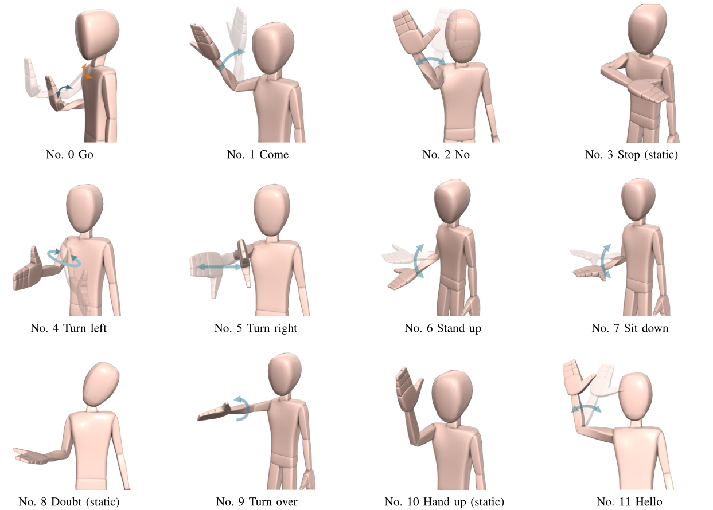

# gesture_database
This database contains totally 154024 data frames (102 minutes) and 1628 gesture instances.

## Subject Information
The gesture database was collected from ten subjects (nine males and one female, aged 22-24). Among the ten subjects, subject 8 and subject 10 are left-handed, and subject 9 is ambidextrous. The other subjects are all right-handed. We collected only right arm gestures on right-handed subjects, and collected both right arm and left arm gestures on left-handed and ambidextrous subjects. 

## Gesture Definition
This gesture database consists of twelve gestures. Among the 12 gestures, three of them are static and the rest are dynamic. The gestures can be performed by both left arm and right arm. Gestures for the left arm are defined as mirror symmetric counterparts of those for right arm.

The following figure shows the right arm gesture definitions.


## Format of Raw Data
Our sensing system includes three IMUs (Bluetooth 3-Space Sensor, YEI). The sensor can provide its absolute orientation in the earth coordinate. Sensors  transmit the orientation data in the form of quaternion with 25Hz sampling frequency. 

The file name of raw data files is in the format of ``%no%arm.dat``, where ``%no`` is the subject No and ``%arm`` is either ``L`` or ``R``, which means left arm and right arm respectively.

Every line of a raw data file (.dat) is senser data of a sample period. Every line contains 12 floats:

```
body_x, body_y, body_z, body_w, uarm_x, uarm_y, uarm_z, uarm_w, farm_x, farm_y, farm_z, farm_w
```

## Format of Ground Truth Data
The file name of ground truth data file is in the same format as raw data file.

Every line of a ground truth data file (.groundtruth) is manually labeled state of a sample period. The state is represented with integer -1 ~ 11. Gestures are numbered 0 to 11, and -1 means non-gesture period. 

The ground truth file and its corresponding raw data file should have the same length.
